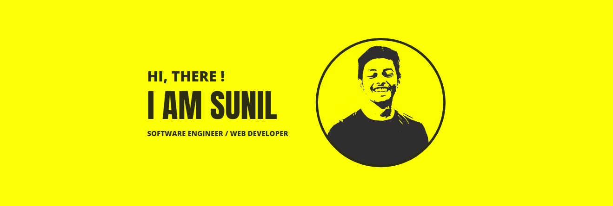

<h3 align="center"><em>Hi, I am Sunil. A software developer / fullstack developer.</em></h3>

  

Hello , I am a Fullstack Developer with skill for crafting interactive and efficient applications. 👨‍💻 I like to work on web development projects and learn new technologies. Currently working on improving my 🛠️ development skills. Looking to contribute on opensource projects for self improvement 💪. I like to watch movies 🎬 in my free time and draw random stuff 🎨.

<h2 align="center">
  Tech I am Familiar with 
</h2>

 

<h2 align="center">
  Connect with me 
</h2>

 

<h2 align="center">
  My Github Stats
</h2>

 

  
  

 

 
